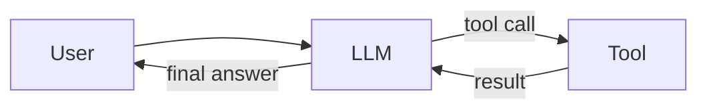
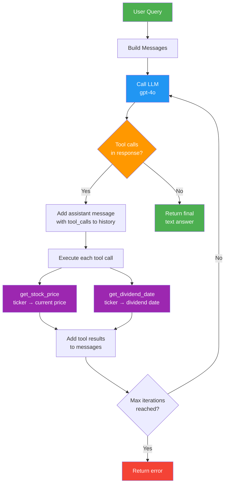

# ReAct AI Agent

This implementation demonstrates a proper **ReAct (Reason and Act)** agent that fixes the limitation in the `4_tools/main-finished.py` example.

## Problem with Original Implementation

The original implementation (`4_tools/main-finished.py`) only handles **one tool call**:

- It processes only the first tool call (`tool_calls[0]`)
- If the LLM needs multiple tool calls to answer a question, it fails
- It doesn't support iterative reasoning where the LLM might need additional tools based on previous results

## ReAct Agent Solution

This implementation provides a proper ReAct loop that:

1. **Handles Multiple Tool Calls**: Processes ALL tool calls in each LLM response
2. **Iterative Reasoning**: Continues calling the LLM until it returns a final answer (no more tool calls)
3. **Maintains Context**: Properly tracks conversation history including all tool calls and results
4. **Prevents Infinite Loops**: Has a maximum iteration limit for safety

## How It Works



### Detailed Flow



## Examples

### Example 1: Single Tool Call

```python
"What is the current stock price for MSFT?"
```

- LLM calls `get_stock_price("MSFT")`
- Returns the price

### Example 2: Multiple Tool Calls

```python
"What are the current prices and dividend dates for both MSFT and AAPL?"
```

- LLM calls 4 tools:
  - `get_stock_price("MSFT")`
  - `get_dividend_date("MSFT")`
  - `get_stock_price("AAPL")`
  - `get_dividend_date("AAPL")`
- Summarizes all results

### Example 3: Sequential Reasoning

```python
"Compare the stock prices of GOOGL and META. Which one is more expensive?"
```

- LLM first calls tools to get both prices
- Then reasons about which is higher
- Returns comparison

## Key Improvements

1. **While Loop**: Replaces single execution with iterative processing
2. **Process All Tool Calls**: Uses `for tool_call in response_message.tool_calls`
3. **Proper Message History**: Maintains complete conversation context
4. **Clean Separation**: ReactAgent class encapsulates the logic

## Requirements

- OpenAI API key in `.env` file as `OPENAI_API_KEY`
- Python 3.12+
- Dependencies: openai, yfinance, python-dotenv

# Run

## Run directly

`uv run main.py` (or alternative files)

## Run indirectly

Create a virtual environment

```bash
uv venv
```

Activate virtual environment

```bash
source .venv/bin/activate
```

Install packages

```bash
uv sync
```

Run script main (or alternative files)

```bash
python main.py
```
