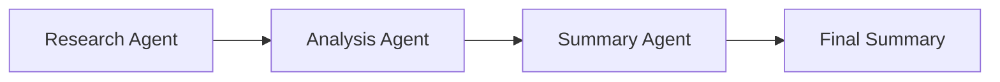
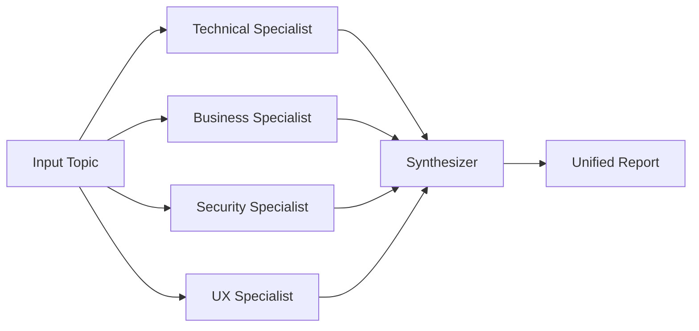
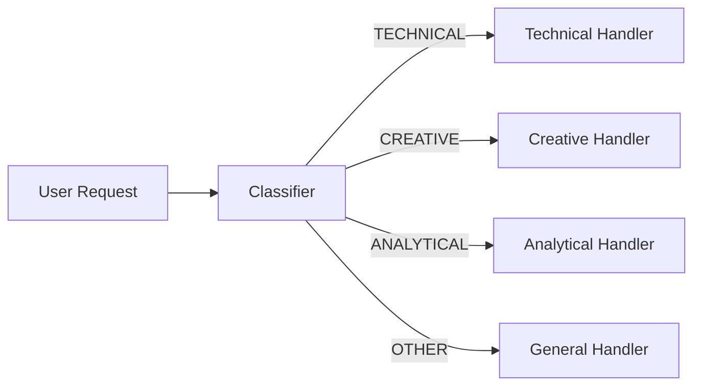
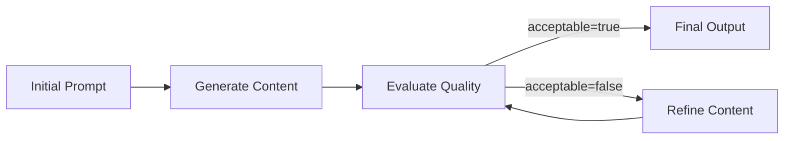

# Workflow Patterns

This folder contains four workflow patterns built with the Codex TypeScript SDK. Each example shows a different way to orchestrate multiple agent turns or threads depending on how work should flow through the system.

## Files

- [`1_sequential_workflow.ts`](/home/lukas/Projects/Github/lukaskellerstein/vibe-coding-course/3_Codex_SDK/typescript/examples/3_workflows/1_sequential_workflow.ts): fixed step-by-step chain
- [`2_parallel_workflow.ts`](/home/lukas/Projects/Github/lukaskellerstein/vibe-coding-course/3_Codex_SDK/typescript/examples/3_workflows/2_parallel_workflow.ts): fan-out to specialists, then synthesize
- [`3_conditional_workflow.ts`](/home/lukas/Projects/Github/lukaskellerstein/vibe-coding-course/3_Codex_SDK/typescript/examples/3_workflows/3_conditional_workflow.ts): classify first, then route to one handler
- [`4_loop_workflow.ts`](/home/lukas/Projects/Github/lukaskellerstein/vibe-coding-course/3_Codex_SDK/typescript/examples/3_workflows/4_loop_workflow.ts): generate, evaluate, and refine until acceptable

## 1. Sequential Workflow

This example is a classic agent chain. Each step waits for the previous one to finish, and the output of one step becomes the input to the next one.

How this example works:
- The workflow starts with a research prompt about TypeScript for large-scale applications.
- The research output is passed into an analysis step.
- The analysis output is passed into a summary step.
- The final result is the summary agent's response.

When to use it:
- The work has a natural order.
- Later steps depend on earlier outputs.
- You want progressive refinement instead of multiple independent perspectives.

## 2. Parallel Workflow

This example uses a fan-out/fan-in pattern. Several specialists work independently on the same topic at the same time, then a synthesizer combines their results.

How this example works:
- A single topic is sent to four specialists with different perspectives.
- The specialists run concurrently with `Promise.all`.
- Their responses are aggregated into one combined prompt.
- A synthesizer agent produces the final report.

When to use it:
- Multiple perspectives can be produced independently.
- Latency matters and the tasks can run concurrently.
- You need a final consolidation step after parallel work finishes.

## 3. Conditional Workflow

This example routes a request based on a classification step. One agent decides which branch is appropriate, and then one specialized handler responds.

How this example works:
- A classifier agent examines the incoming request.
- The classifier returns structured output with a category and reasoning.
- The workflow selects one handler based on that category.
- Only the chosen handler processes the request further.

When to use it:
- Different request types need different prompts or specialist roles.
- You want adaptive routing instead of one fixed pipeline.
- You need predictable branching logic before deeper work starts.

Why this example is useful:
- It demonstrates structured output for control flow.
- It separates routing from execution cleanly.
- It keeps handler prompts specialized and simpler.

## 4. Loop Workflow

This example shows iterative refinement. Content is generated, evaluated, and refined until it is acceptable or a maximum number of iterations is reached.

How this example works:
- The workflow generates an initial draft.
- An evaluator scores the result with structured output: `score`, `acceptable`, and `feedback`.
- If quality is insufficient, the draft is refined using the evaluator's feedback.
- The cycle repeats until the content is acceptable or `maxIterations` is reached.

When to use it:
- Quality improves through critique and revision.
- You need a stopping rule based on explicit evaluation.
- A single-pass response is usually not good enough.

## Pattern Selection

Choose sequential when each stage depends on the previous stage.

Choose parallel when several independent analyses can run at once and be merged later.

Choose conditional when the first task is deciding which specialist or branch should handle the request.

Choose loop when the core problem is iterative improvement with an evaluation checkpoint.

## Notes About These Examples

- These examples are workflow patterns, not agent hierarchies like supervisor or swarm.
- Each file focuses on orchestration logic more than reusable abstractions.
- The conditional and loop workflows already use structured output where control decisions depend on model output.
- The parallel workflow uses concurrency at the application level with `Promise.all`.
