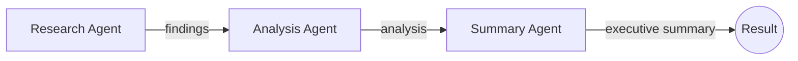
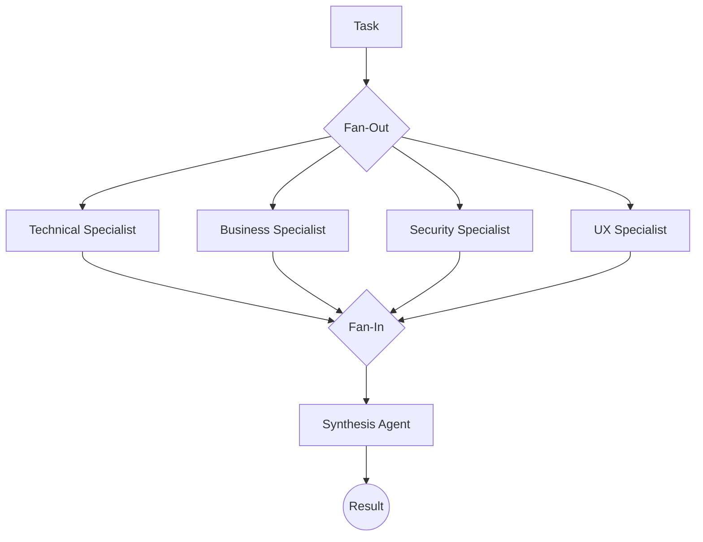
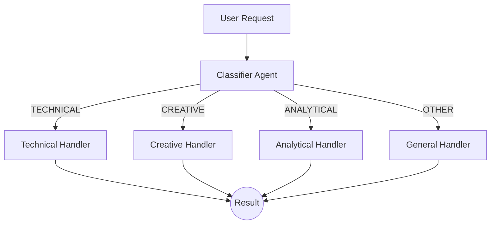
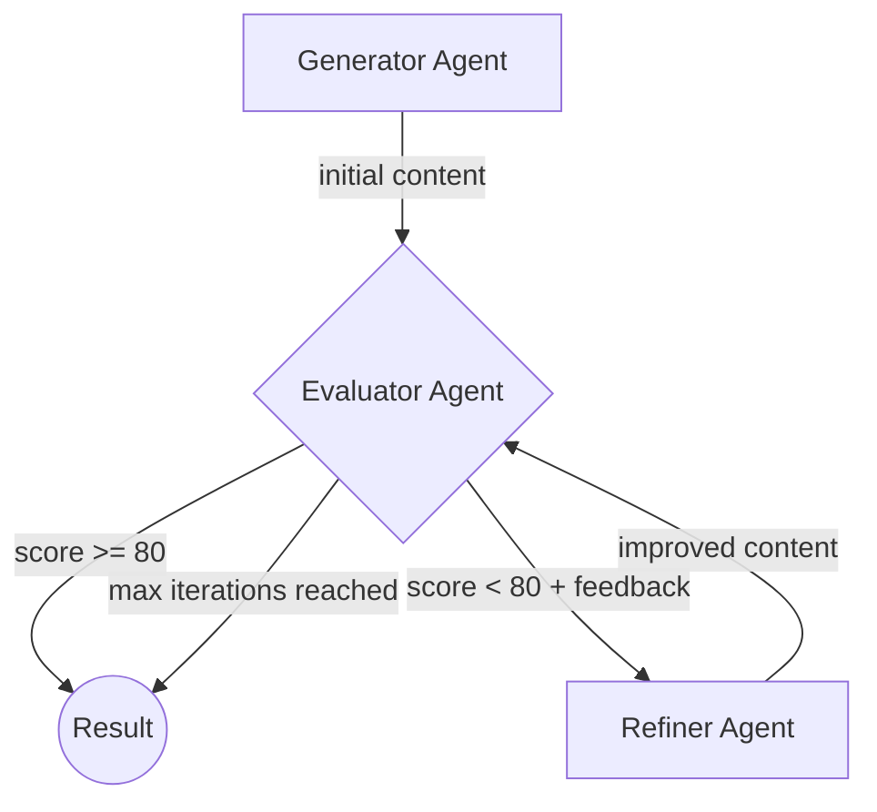

# Workflow Patterns

Four execution patterns for orchestrating AI agents. Each pattern solves a different coordination problem.

## 1. Sequential Workflow

A linear pipeline where the output of one agent becomes the input to the next.



**Example:** Research the benefits of Python's asyncio, analyze the findings, then produce an executive summary.

**When to use:** Tasks with clear, dependent stages where each step needs the previous step's output.

```bash
python 1_sequential_workflow.py
```

---

## 2. Parallel Workflow (Fan-Out / Fan-In)

Multiple specialist agents analyze the same problem simultaneously from different angles, then a synthesis agent aggregates the results.



**Example:** Analyze "adopting microservices architecture" from four perspectives (technical, business, security, UX) in parallel, then synthesize into a unified report.

**When to use:** Multi-perspective analysis where specialists are independent and can run concurrently. Uses `anyio.create_task_group()` for parallel execution.

```bash
python 2_parallel_workflow.py
```

---

## 3. Conditional Workflow (IF/ELSE Routing)

A classifier agent categorizes the request, then routes it to the appropriate specialized handler.



**Example:** The classifier categorizes requests like "write a Fibonacci function" (TECHNICAL), "write a story about a robot" (CREATIVE), or "analyze remote vs office work" (ANALYTICAL), then routes to the matching handler.

**When to use:** Requests that need different treatment depending on their nature. The classifier determines the path, and only one handler runs.

```bash
python 3_conditional_workflow.py
```

---

## 4. Loop Workflow (Iterative Refinement)

An agent generates content, an evaluator scores it, and if the quality threshold isn't met, a refiner improves it. The loop repeats until the score is acceptable or max iterations are reached.



**Example:** Generate a technical blog post introduction, evaluate its quality (score 0-100), refine based on feedback, repeat until score >= 80 or 5 iterations.

**When to use:** Tasks where quality is measurable and iterative improvement is possible. The evaluator provides structured feedback (score + suggestions) that guides refinement.

```bash
python 4_loop_workflow.py
```
