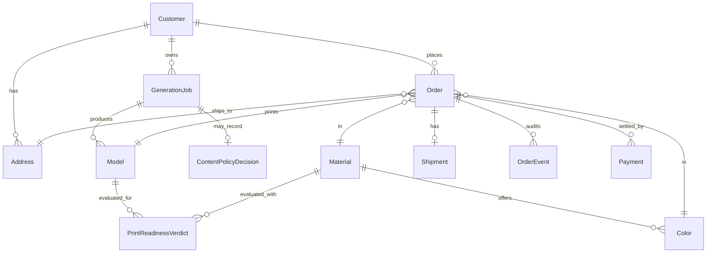
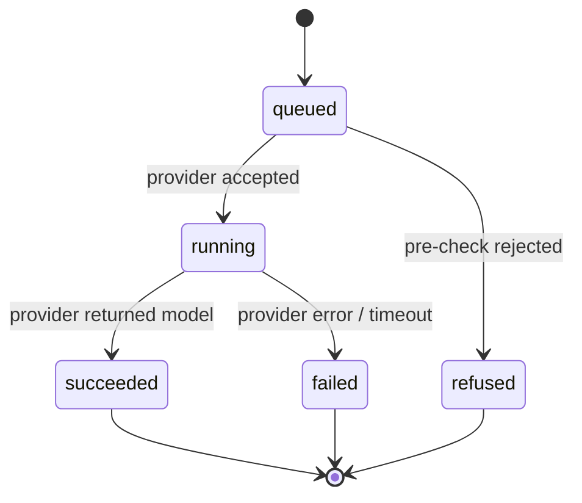
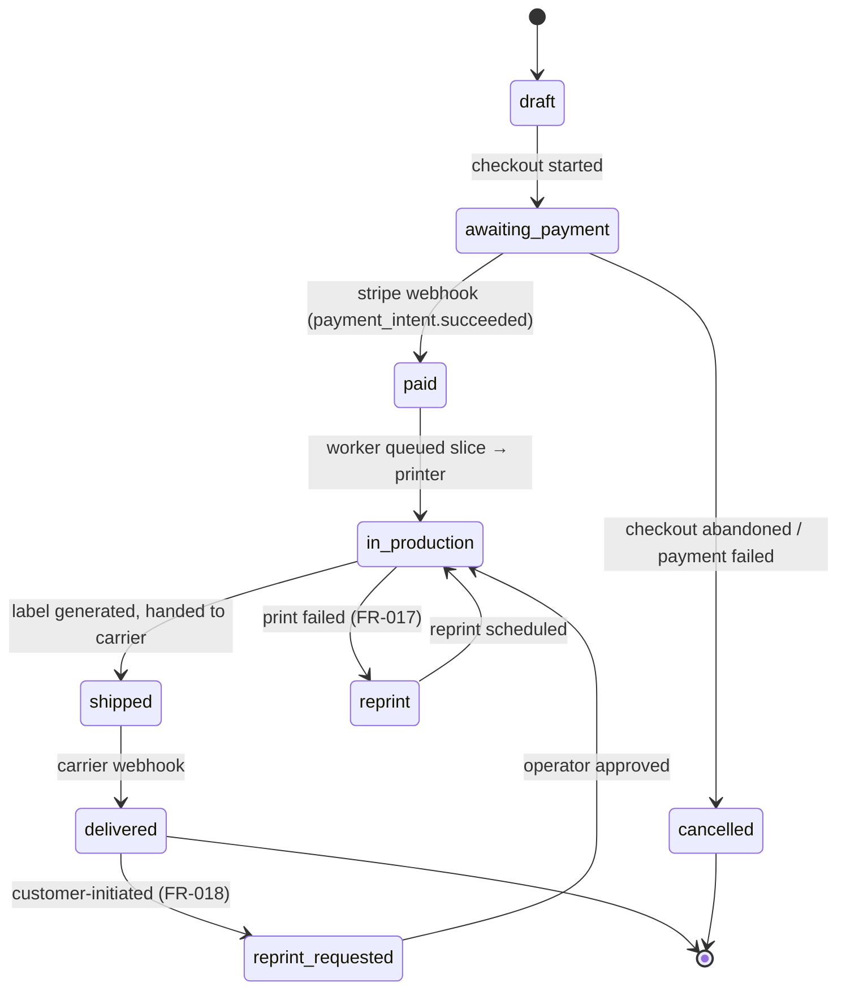

# Phase 1 Data Model: Imagineer

**Feature**: 001-imagineer-3d-printing
**Date**: 2026-05-05

This document specifies the persisted entities, their fields and relationships, the validation rules carried over from the spec's Functional Requirements, and the state machines that own the lifecycle of jobs and orders. The schema target is Postgres 16 via Drizzle ORM. Field types here are SQL-shaped; the Drizzle column types are mechanical translations.

## Entity Overview



## Tables

### `customer`

Represents an individual placing orders. Created on first email submission (guest checkout flow); upgraded with auth credentials when the magic link is consumed.

| Column | Type | Constraints | Notes |
|---|---|---|---|
| `id` | uuid | PK, default `gen_random_uuid()` | |
| `email` | citext | UNIQUE, NOT NULL | Lowercased on write. |
| `email_verified_at` | timestamptz | NULL until magic link consumed | |
| `display_name` | text | NULL | Optional, set by user later. |
| `created_at` | timestamptz | NOT NULL, default now() | |
| `updated_at` | timestamptz | NOT NULL, default now() | Trigger-updated. |
| `marketing_opt_in` | boolean | NOT NULL, default false | |

**Validation rules** (FR-013):
- `email` must be RFC-5322 valid before insert (Zod at boundary).
- `email_verified_at` is NULL only while a guest order is in flight; payment is not accepted while NULL.

---

### `address`

US shipping address validated by SmartyStreets before persistence (FR-015).

| Column | Type | Constraints | Notes |
|---|---|---|---|
| `id` | uuid | PK | |
| `customer_id` | uuid | FK → customer(id), NOT NULL | |
| `recipient_name` | text | NOT NULL | |
| `street1` | text | NOT NULL | |
| `street2` | text | NULL | |
| `city` | text | NOT NULL | |
| `state` | char(2) | NOT NULL | US state code. |
| `postal_code` | text | NOT NULL | ZIP or ZIP+4. |
| `country` | char(2) | NOT NULL, default `'US'` | Single-region MVP. |
| `dpv_match_code` | text | NOT NULL | SmartyStreets verdict — `Y`, `S`, `D`, or `N`. Only `Y`/`S` are deliverable. |
| `validated_at` | timestamptz | NOT NULL | |
| `created_at` | timestamptz | NOT NULL, default now() | |

**Validation rules** (FR-015):
- INSERT requires a SmartyStreets response with `dpv_match_code` ∈ {`Y`, `S`}; `D` and `N` are rejected with the customer-facing reason returned by SmartyStreets.

---

### `generation_job`

A single attempt to generate a 3D model from an input. One row per attempt — regenerations create a new row, never mutate an existing one. (Spec — Generation Job entity.)

| Column | Type | Constraints | Notes |
|---|---|---|---|
| `id` | uuid | PK | |
| `customer_id` | uuid | FK → customer(id), NULL allowed | NULL while the visitor is unauthenticated; backfilled on email submission. |
| `session_id` | text | NOT NULL | Browser session id, used to bind anonymous jobs to the eventual customer. |
| `input_kind` | enum (`text`, `image`) | NOT NULL | |
| `input_text` | text | NULL | Set when `input_kind = 'text'`. |
| `input_image_uri` | text | NULL | R2 URI when `input_kind = 'image'`. |
| `provider` | enum (`meshy`, `tripo`) | NOT NULL | |
| `provider_job_id` | text | NULL | Returned by provider on submit. |
| `status` | enum (see state machine below) | NOT NULL | |
| `failure_reason` | text | NULL | Populated on `failed` or `refused`. |
| `submitted_at` | timestamptz | NOT NULL, default now() | |
| `completed_at` | timestamptz | NULL | |
| `cost_units_usd` | numeric(8,4) | NULL | Provider-side cost recorded for unit-economics. |

**Indexes**:
- `(customer_id, submitted_at desc)` for user history.
- `(session_id, submitted_at desc)` for resume-anonymous-flow.
- `(status, submitted_at)` for worker scans.

**State machine** (FR-001..FR-005):



- `queued → refused` records a `ContentPolicyDecision` (FR-005).
- `running → failed` triggers a customer-visible "try again" affordance and the customer is not charged.
- A `succeeded` job produces exactly one `Model` row.

---

### `model`

A previewable, potentially printable 3D representation. (Spec — Model entity.)

| Column | Type | Constraints | Notes |
|---|---|---|---|
| `id` | uuid | PK | |
| `generation_job_id` | uuid | FK → generation_job(id), NOT NULL | |
| `glb_uri` | text | NOT NULL | R2 URI, preview-quality GLB. |
| `refined_glb_uri` | text | NULL | High-poly GLB used for slicing; populated by worker post-process. |
| `stl_uri` | text | NULL | Sliced STL used by the printer. |
| `thumbnail_uri` | text | NOT NULL | Six-angle composite for non-WebGL fallback. |
| `bounding_box_mm` | jsonb | NOT NULL | `{x, y, z}` in millimetres. |
| `volume_mm3` | numeric(12,2) | NULL | Set after slicing; nullable while only the preview exists. |
| `approved_at` | timestamptz | NULL | Set when the customer approves this model for an order. |
| `created_at` | timestamptz | NOT NULL, default now() | |

**Validation rules** (FR-006..FR-009):
- `bounding_box_mm` is computed at GLB-load time by the worker and used to enforce build-volume checks against each candidate `Material`.
- `approved_at` is monotonic — once set, the row is immutable except for `stl_uri` backfill.

---

### `print_readiness_verdict`

One verdict per (Model, Material) pair, written by the slicer worker (FR-009..FR-011).

| Column | Type | Constraints | Notes |
|---|---|---|---|
| `id` | uuid | PK | |
| `model_id` | uuid | FK → model(id), NOT NULL | |
| `material_id` | uuid | FK → material(id), NOT NULL | |
| `verdict` | enum (`ready`, `repaired`, `rejected`) | NOT NULL | `repaired` = slicer auto-fixed; `rejected` = unrecoverable. |
| `min_wall_thickness_mm` | numeric(5,3) | NOT NULL | What the slicer measured. |
| `slice_time_seconds` | integer | NOT NULL | |
| `print_time_seconds` | integer | NULL | Estimated by slicer; required when `verdict ∈ {ready, repaired}`. |
| `material_volume_mm3` | numeric(12,2) | NULL | Required when `verdict ∈ {ready, repaired}`. |
| `notes` | text | NULL | Slicer warnings, repair description, or rejection reason. |
| `created_at` | timestamptz | NOT NULL, default now() | |

**Uniqueness**: `(model_id, material_id)` UNIQUE — one verdict per pair, recomputed only if the slicer or profile is upgraded (which triggers a new row with a different timestamp; we soft-version by keeping the latest).

---

### `material`

The material catalog (FR-010, FR-011).

| Column | Type | Constraints | Notes |
|---|---|---|---|
| `id` | uuid | PK | |
| `slug` | text | UNIQUE, NOT NULL | e.g. `pla-standard`, `petg-durable`, `resin-tough`, `tpu-flexible`. |
| `display_name` | text | NOT NULL | |
| `description` | text | NOT NULL | Plain-language properties text shown to customer. |
| `process` | enum (`fdm`, `sla`) | NOT NULL | |
| `min_wall_thickness_mm` | numeric(5,3) | NOT NULL | Used by the slicer profile. |
| `build_volume_mm` | jsonb | NOT NULL | `{x, y, z}` of the printer that runs this material. |
| `cost_per_mm3_usd` | numeric(8,6) | NOT NULL | Used by the pricing calculator. |
| `lead_time_days` | integer | NOT NULL | Production-only; shipping added separately. |
| `prusa_profile_path` | text | NOT NULL | Path under `infra/prusaslicer/`. |
| `is_available` | boolean | NOT NULL, default true | |
| `unavailable_reason` | text | NULL | Customer-facing when `is_available = false`. |
| `restock_estimated_at` | date | NULL | Populated when out of stock. |

---

### `color`

Per-material colors (FR-011).

| Column | Type | Constraints | Notes |
|---|---|---|---|
| `id` | uuid | PK | |
| `material_id` | uuid | FK → material(id), NOT NULL | |
| `slug` | text | NOT NULL | e.g. `white`, `matte-black`, `ember-orange`. |
| `display_name` | text | NOT NULL | |
| `hex` | char(7) | NOT NULL | `#RRGGBB` for the swatch. |
| `is_available` | boolean | NOT NULL, default true | |
| `unavailable_reason` | text | NULL | |

**Uniqueness**: `(material_id, slug)`.

---

### `order`

A customer's commitment to print a Model in a Material/Color and ship it. (Spec — Order entity.)

| Column | Type | Constraints | Notes |
|---|---|---|---|
| `id` | uuid | PK | |
| `customer_id` | uuid | FK → customer(id), NOT NULL | |
| `model_id` | uuid | FK → model(id), NOT NULL | |
| `material_id` | uuid | FK → material(id), NOT NULL | |
| `color_id` | uuid | FK → color(id), NOT NULL | |
| `address_id` | uuid | FK → address(id), NOT NULL | |
| `status` | enum (see state machine) | NOT NULL | |
| `subtotal_cents` | integer | NOT NULL | Production cost (volume × material rate + overhead). |
| `shipping_cents` | integer | NOT NULL | Quoted by Shippo at checkout. |
| `tax_cents` | integer | NOT NULL | Computed by Stripe Tax. |
| `total_cents` | integer | NOT NULL | `subtotal + shipping + tax`. |
| `currency` | char(3) | NOT NULL, default `'USD'` | |
| `estimated_delivery_at` | date | NOT NULL | `today + lead_time + shipping_days` at checkout. |
| `placed_at` | timestamptz | NOT NULL, default now() | |
| `paid_at` | timestamptz | NULL | |
| `production_started_at` | timestamptz | NULL | |
| `shipped_at` | timestamptz | NULL | |
| `delivered_at` | timestamptz | NULL | |
| `cancelled_at` | timestamptz | NULL | |
| `idempotency_key` | text | UNIQUE | For webhook-driven transitions. |

**Indexes**: `(customer_id, placed_at desc)`, `(status)`.

**State machine** (FR-013..FR-018):



---

### `payment`

One row per Stripe payment intent. The Order may have multiple if the customer retries (FR-014).

| Column | Type | Constraints | Notes |
|---|---|---|---|
| `id` | uuid | PK | |
| `order_id` | uuid | FK → order(id), NOT NULL | |
| `stripe_payment_intent_id` | text | UNIQUE, NOT NULL | |
| `amount_cents` | integer | NOT NULL | |
| `status` | enum (`requires_action`, `processing`, `succeeded`, `failed`) | NOT NULL | Mirrors Stripe. |
| `created_at` | timestamptz | NOT NULL, default now() | |
| `succeeded_at` | timestamptz | NULL | |
| `failed_reason` | text | NULL | |

---

### `shipment`

One row per Shippo label. (Spec — Shipment entity.)

| Column | Type | Constraints | Notes |
|---|---|---|---|
| `id` | uuid | PK | |
| `order_id` | uuid | FK → order(id), UNIQUE NOT NULL | One shipment per order in MVP. |
| `carrier` | text | NOT NULL | `usps`, `ups`. |
| `service_level` | text | NOT NULL | `usps_ground_advantage`, `ups_ground`. |
| `tracking_number` | text | NOT NULL | |
| `tracking_url` | text | NOT NULL | |
| `label_uri` | text | NOT NULL | R2 URI to PDF label. |
| `dispatched_at` | timestamptz | NULL | |
| `delivered_at` | timestamptz | NULL | |
| `created_at` | timestamptz | NOT NULL, default now() | |

---

### `order_event`

Append-only audit log per order (FR-019).

| Column | Type | Constraints | Notes |
|---|---|---|---|
| `id` | uuid | PK | |
| `order_id` | uuid | FK → order(id), NOT NULL | |
| `event_type` | text | NOT NULL | E.g. `placed`, `paid`, `production_started`, `print_failed`, `shipped`, `delivered`, `reprint_requested`. |
| `payload` | jsonb | NOT NULL | Free-form contextual data — webhook payload, operator note, etc. |
| `actor` | text | NOT NULL | `system`, `customer:<id>`, `operator:<id>`, `webhook:<source>`. |
| `created_at` | timestamptz | NOT NULL, default now() | |

**Index**: `(order_id, created_at)`.

---

### `content_policy_decision`

One row per refusal (FR-005, FR-019). (Spec — Content Policy Decision entity.)

| Column | Type | Constraints | Notes |
|---|---|---|---|
| `id` | uuid | PK | |
| `generation_job_id` | uuid | FK → generation_job(id), NOT NULL | |
| `stage` | enum (`pre_check`, `post_check`) | NOT NULL | |
| `rule_id` | text | NOT NULL | Stable id of the rule that fired (e.g. `weapons.firearm`, `trademark.disney`). |
| `customer_message` | text | NOT NULL | What the customer was shown. |
| `evidence` | jsonb | NULL | Matched terms, provider moderation flags, etc. — not shown to customer. |
| `created_at` | timestamptz | NOT NULL, default now() | |

---

### `auth_email_token`

Magic-link tokens issued by Auth.js (FR-013, supplemental). Schema follows the Auth.js Drizzle adapter; included here for completeness.

| Column | Type | Constraints |
|---|---|---|
| `identifier` | text | NOT NULL |
| `token` | text | NOT NULL |
| `expires` | timestamptz | NOT NULL |

PK: `(identifier, token)`.

---

## Cross-Cutting Validation Rules

These belong in `packages/domain` and are enforced before any DB write:

1. **Order may not transition to `paid` while `customer.email_verified_at` is NULL.** Prevents printing for an unconfirmed identity.
2. **Order may not be created against a `model` whose `print_readiness_verdict` for the chosen `material` is `rejected`.** (FR-009, FR-011.)
3. **Order may not be created against a `material` or `color` with `is_available = false`.** (FR-011.)
4. **Address must have `dpv_match_code ∈ {Y, S}` before being attached to an Order.** (FR-015, SC-008.)
5. **Stripe webhook handlers MUST upsert by `stripe_payment_intent_id`** to make replays idempotent.
6. **`order_event` writes are append-only** — no UPDATE, no DELETE in application code; enforced by a Drizzle helper.

## Pricing Function

`packages/domain/pricing` is a pure function:

```text
total_cents(model, material, color, address) =
  ceil(model.volume_mm3 × material.cost_per_mm3_usd × OVERHEAD_MULTIPLIER × 100)
  + shipping_cents(address, material)
  + tax_cents(subtotal, shipping, address)
```

Where `OVERHEAD_MULTIPLIER` covers labor + machine time + packaging, configured via `packages/config`. Shipping and tax are quoted live from Shippo and Stripe Tax respectively.
